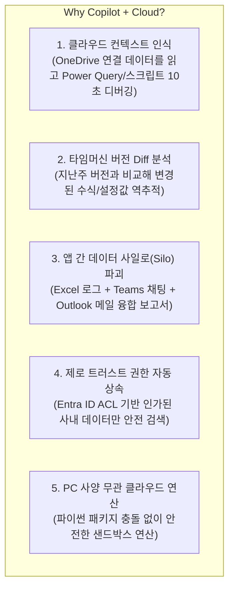

# 📘 Microsoft 365 Copilot 실무 마스터 과정 (네트워크 엔지니어 특화)
> **최종 마스터 기획서 & 슬라이드 덱 상세 구성안**  
> *작성일: 2026-08-22 | 대상: 네트워크 엔지니어 및 IT/개발 전문가*

---

## 🎯 1. 강의 개요

* **과정명**: 네트워크 엔지니어를 위한 Microsoft 365 Copilot & AI 엔지니어링 실무 마스터
* **교육 대상**: 네트워크 엔지니어, 클라우드/인프라 운영자, 보안 담당자 (개발 및 네트워크 이해도 높음)
* **권장 교육 시간**: 6~7시간 (1일 집중 과정) 또는 2회차 분할 과정 (이론 25%, 실습 및 시연 75%)
* **핵심 도구 스택**:
  * **M365 Copilot Suite**: Excel (분석가 도구), Outlook (예약 프롬프트), PowerPoint, Word, Teams, OneNote, Mobile Word
  * **엔지니어링 시각화**: Mermaid.js, Excalidraw
  * **데이터 분석 백엔드**: Python in Excel, Microsoft Graph (Work IQ), Bing Grounding

---

## 💡 2. 엔지니어가 Copilot을 적극 도입해야 하는 핵심 이유 (Why Copilot?)

---

## 🗺️ 3. 모듈별 중요도 및 전체 슬라이드 덱 구조 (총 34 슬라이드)

| 모듈 구분 | 슬라이드 범위 | 주요 학습 내용 및 기술 요소 |
| :--- | :---: | :--- |
| **Part 1. 기초 & 보안 메커니즘** | Slide 01~06 | • Why Copilot (Power Query 디버깅 실사례) • 5대 클라우드 시너지 • Graph 아키텍처 & 4대 프롬프트 공식 • **[보안] Work vs Web 모드 & 쿼리 변환(Query Transformation)** |
| **Part 2. [집중] Excel 분석가 도구** | Slide 07~12 | • 네트워크 로그(Syslog, NetFlow) 전처리 & CIDR 수식 • **분석가 도구(Analyst Agent) & Python in Excel** • DDoS/스파이크 이상치 탐지 & 대역폭 시계열 예측 • [실습 1] 방화벽 로그 분석 실전 |
| **Part 3. 다이어그램 코드화** | Slide 13~16 | • Diagrams as Code 철학 • Copilot ➔ Mermaid (L2/L3 토폴로지, 시퀀스) • **Excalidraw 원클릭 연동 (Mermaid to Diagram)** • [실습 2] 아키텍처 시각화 실전 |
| **Part 4. Outlook 이메일 & 예약** | Slide 17~20 | • 50개 핑퐁 장애 메일 스레드 3줄 요약 • **[핵심] Copilot 미팅/점검 예약 프롬프트** • 안건(Agenda) 3가지 자동 포함 회의 초대장 • [실습 3] 장애 회신 & 일정 예약 |
| **Part 5. PowerPoint 운용 & 리뉴얼** | Slide 21~24 | • **신규 패키지/릴리즈 ➔ 운용자 친화 슬라이드 변환** • **오래된 레거시 PPT 현대화 (Modernization)** • 모던 카드 레이아웃 & Q&A 발표 대본 • [실습 4] 패키지 브리핑 & 슬라이드 리빌딩 |
| **Part 6. Word & OneNote & 모바일** | Slide 25~29 | • **난해한 RFC/벤더 스펙 ➔ 쉬운 기술 해설서 변환** • SOP(표준 운영 절차) & Post-Mortem 표준화 • **OneNote AI 전자필기장 (현장 메모 ➔ To-Do/지식화)** • **모바일 Word Copilot (서버실 음성 보고서/요약)** • [실습 5] 1페이지 가이드화 & 필기 정리 |
| **Part 7. Teams & 종합 엔드투엔드** | Slide 30~34 | • Teams 장애 워룸 타임라인 & 온콜 인수인계 • **[종합 실습] 대규모 네트워크 장애 엔드투엔드 시나리오** • 엔지니어링 보안 체크리스트 & Quiz • 실무 프롬프트 치트시트 배포 & 마무리 |

---

## 📑 4. 슬라이드별 상세 목차 (34 장표)

### 🔹 Part 1. 엔지니어를 위한 Copilot 기초, 클라우드 가치 & 보안
* **Slide 01**: 과정 소개 및 엔지니어링 중심 아젠다
* **Slide 02**: [Why Copilot?] 엔지니어가 체감하는 클라우드 컨텍스트 인식 (Power Query/스크립트 디버깅 사례)
* **Slide 03**: 엔지니어를 위한 5대 클라우드 시너지 (타임머신 Diff, 사일로 파괴, RAG 없는 검색, 제로 트러스트, 클라우드 연산)
* **Slide 04**: M365 Copilot 기술 아키텍처 (LLM + Microsoft Graph + Work IQ)
* **Slide 05**: 엔지니어링 프롬프트 4원칙 (역할 + 맥락 + 제약조건 + 출력 스키마)
* **Slide 06**: [보안 딥다이브] Work(사내) vs Web(외부) 검색 구분 & 쿼리 변환(Query Transformation) 원리

### 🔹 Part 2. [집중 모듈] Excel Copilot: 대용량 데이터 & 분석가 도구
* **Slide 07**: 네트워크 로그 전처리 및 표(Table) 서식화 (CIDR, Subnet 계산)
* **Slide 08**: 트래픽 피벗 집계 및 다중 조건 수식 (Top Talker 추출)
* **Slide 09**: [핵심] 분석가 도구(Analyst Agent)와 Python in Excel 메커니즘
* **Slide 10**: 이상 트래픽(DDoS/스파이크) 탐지 (Isolation Forest & Z-Score 모델)
* **Slide 11**: 대역폭 사이징 및 시계열 예측 (향후 6개월 트래픽 추세)
* **Slide 12**: [실습 1] 방화벽 로그 분석 실전 (이상치 탐지 ➔ 히트맵 차트 ➔ 브리핑)

### 🔹 Part 3. 네트워크 토폴로지 & 다이어그램 코드화 (Mermaid & Excalidraw)
* **Slide 13**: Diagrams as Code: 텍스트 기반 다이어그램의 강력함
* **Slide 14**: Copilot으로 Mermaid 코드 생성 (L2/L3 토폴로지, 패킷 핸드셰이크 시퀀스)
* **Slide 15**: Excalidraw 원클릭 연동 (Mermaid to Diagram 기능으로 모던 벡터 다이어그램 변환)
* **Slide 16**: [실습 2] 아키텍처 다이어그램 생성 실전

### 🔹 Part 4. Outlook Copilot: 스마트 이메일 & 지능형 예약 프롬프트
* **Slide 17**: 장애 알림 및 핑퐁 메일 스레드 3줄 요약
* **Slide 18**: [핵심] Copilot 미팅 예약 프롬프트 (정기 점검 & Post-Mortem 캘린더 조율)
* **Slide 19**: 지능형 초대장 & 안건(Agenda 3가지) 자동 완성
* **Slide 20**: [실습 3] 장애 대응 회신 & 미팅 예약 실전

### 🔹 Part 5. PowerPoint Copilot: 신규 패키지 설명 & 레거시 슬라이드 리뉴얼
* **Slide 21**: 신규 제품/패키지 설명서 ➔ 운용자 친화 슬라이드 변환 (변경점/영향도/주의사항)
* **Slide 22**: 오래된 레거시 PPT 현대화 (Modernization): 줄글 ➔ 모던 카드 레이아웃 & 최신 용어
* **Slide 23**: 모던 비주얼 디자인 적용 & 발표자 Q&A 대본 자동 생성
* **Slide 24**: [실습 4] 패키지 브리핑 & 슬라이드 리뉴얼 실전

### 🔹 Part 6. Word & OneNote & 모바일: 지식 관리 & 쉬운 기술문서화
* **Slide 25**: 난해한 기술 문서(RFC, 벤더 스펙)의 쉬운 해설화 (비유 + 용어 사전 + 체크리스트)
* **Slide 26**: 표준 운영 절차(SOP) 및 5-Why Post-Mortem 표준화
* **Slide 27**: OneNote AI 전자필기장: 현장 점검 메모 구조화 및 Action Item 추출
* **Slide 28**: 모바일 Word Copilot: 서버실/외근/이동 중 음성 작업 보고서 및 긴급 문서 요약
* **Slide 29**: [실습 5] 1페이지 가이드화 & OneNote 필기 정리 실전

### 🔹 Part 7. Teams Copilot & 종합 엔드투엔드 실습
* **Slide 30**: Teams 장애 워룸 타임라인 실시간 요약 및 온콜(On-Call) 인수인계
* **Slide 31**: [종합 E2E 실전 프로젝트]: Excel 이상 탐지 ➔ Mermaid 시각화 ➔ Word 보고서 ➔ 모바일 검토 ➔ PPT 리뉴얼 ➔ Outlook 예약
* **Slide 32**: 엔지니어링 데이터 보안 & 거버넌스 체크리스트 (IP/키 마스킹)
* **Slide 33**: 모듈별 지식 점검 (Quiz)
* **Slide 34**: Q&A 및 네트워크 전용 프롬프트 치트시트 배포

---

## 🛠️ 5. 실습 시나리오 및 핵심 프롬프트 예시집

### 1) Excel 분석가 도구 프롬프트
> *"방화벽 차단 로그 테이블을 분석해서, 패킷 유입량이 평소 대비 3표준편차 이상 급증한 시간대와 출발지 IP를 식별해줘. 이를 시계열 꺾은선 차트와 주요 공격 유형 요약 브리핑으로 출력해줘."*

### 2) Mermaid ➔ Excalidraw 프롬프트
> *"본사 코어 라우터와 2개의 데이터센터(DC-A, DC-B) 간 BGP 이중화 경로를 나타내는 L3 네트워크 토폴로지를 Mermaid flowchart 문법으로 작성해줘. 서브넷 대역과 포트 번호도 라벨에 포함해줘."*

### 3) Outlook 미팅 예약 프롬프트
> *"본 메일 스레드의 장애 원인과 복구 타임라인을 요약하여 본문에 넣고, 인프라팀 및 보안팀 담당자와 내일 오전 10시에 45분간 회의 일정을 예약해줘. 안건 3가지(①근본 원인 분석, ②단기 완화 조치, ③장기 재발 방지책)를 추가해줘."*

### 4) PowerPoint 패키지 요약 & 리뉴얼 프롬프트
> *"첨부된 50페이지짜리 스위치 펌웨어 릴리즈 노트를 현장 운용 엔지니어가 10분 만에 파악할 수 있도록 ①기존 대비 주요 변경점, ②호환성 및 설정 영향도, ③작업 시 주의사항 중심의 4장 슬라이드로 구성해줘."*

### 5) Word 기술 문서 쉬운 해설 프롬프트
> *"이 영문 RFC 8365 (BGP EVPN) 문서를 네트워크 주니어 엔지니어와 타 부서 협업자가 쉽게 이해할 수 있도록, 일상적인 택배 배송 시스템에 빗대어 개념을 설명하고, 필수 용어 5개 정의와 실무 운영 체크리스트를 표로 만들어줘."*
